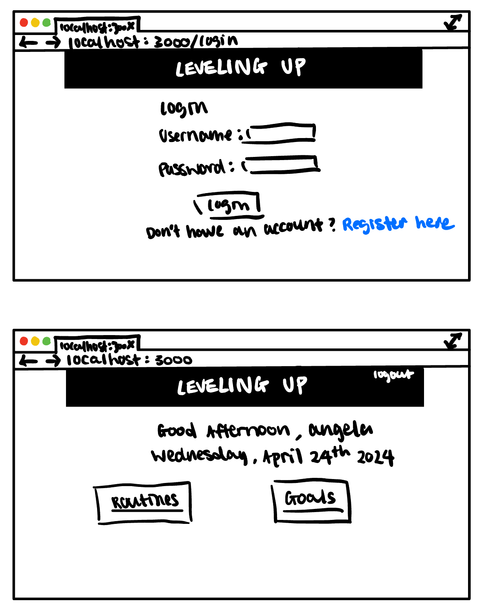
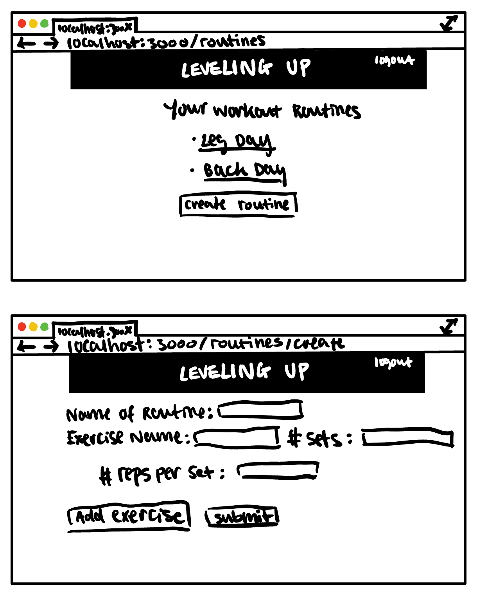
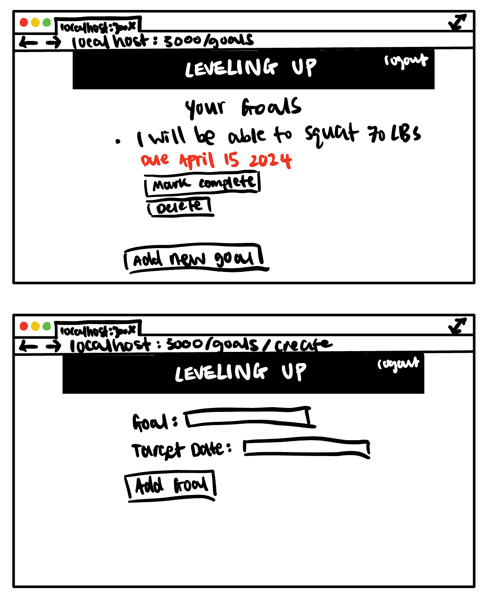

# LevelingUp

## Overview

Do you want to make a change in your life for the better? You can! Through LevelingUp, you get to fully customize your workout routine and set fitness goals! LevelingUp helps you keep track of your fitness journey. You can register for an account and log your routine. For each routine, you can add as many exercises as you desire. You can also set goals so you are aware of your progress!

## Data Model

LevelingUp will have data regarding the user and their respective workout routine and goals.

* A user can have multiple workout routines and multiple goals (one to many) (Referencing)
* Each workout routine will have a list of different exercises (Embedded)

Example User:

```javascript
{
  username: "gymrat",
  password: // hashed password,
  routines: // array of references to workout routines
  goals: // array of references to goals
}
```

Example Workout Routine:

```javascript
{
  name: "Leg Day",
  exercises: [
    {exerciseName: "squats", sets: 4, reps: 10},
    {exerciseName: "RDLs", sets: 4, reps: 10},
    {exerciseName: "hip abductors", sets: 4, reps: 12},
    {exerciseName: "leg extensions", sets: 3, reps: 12},
  ]
}
```

Example Goal:

```javascript
{
  description: "I want to be able to squat 70 pounds",
  targetDate: // user sets deadline,
  completed: False
}
```

## [Link to Commented First Draft Schema](db.mjs) 


## Wireframes

/login - page user authentication\
/home- home page to view time, routines, and goals



/routines - page for viewing all existing routines created by the user\
/routines/create - page for creating a new routine and add exercises



/goals - page for all existing goals created by the user\
/goals/add - page for adding new goals and deadlines



## Site map


## User Stories or Use Cases

1. as new user, I can register for a new account when I got on the website
2. as a user, I can log in to the website
3. as a user, I can create one or more workout routines
4. as a user, I can set specific goals and deadlines
5. as a user, I can add exercises and goals

## Research Topics

* (6 points) User authentication
    * User authentication is the process in which authorized users can access the website that are somewhat customized/private to them
    * Passport is a middleware that authenticates requests
    * MongoDB will be used to store user information
    * This library has many nuances to learn, so I will be giving this task 6 points
  
* (4 points) Show day of the week after user login
    * Accessing time is important for my website because it provides more accessibility
    * Users can see the day of the week on the home page so they can better navigate their workout routine
    * I will be using Moment.js to accomplish this
    * Moment.js can easily fetch and manipulate time on the web

10 points in total

## [Link to Initial Main Project File](app.mjs) 

## Annotations / References Used

1. [passport.js docs](http://passportjs.org/docs)
2. [implement passport with node.js tutorial](https://medium.com/@prashantramnyc/node-js-with-passport-authentication-simplified-76ca65ee91e5)
3. [moment.js docs](https://momentjs.com/)